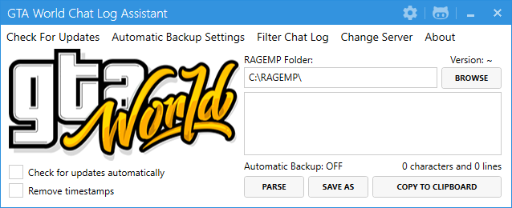

# GTA World Chat Log Assistant
This program is used to convert the chat logs generated while playing on GTA World into readable text.

## Getting Started

No installation is required. Simply download the latest [release](https://github.com/MapleToo/GTAW-Log-Parser/releases) and run the executable.

For a brief overview, please refer to the [feature showcase thread](https://forum.gta.world/en/index.php?/topic/7690-chat-logs/) on the GTA World forums.

## Building

The NuGet package dependencies must be restored before compiling the project.

## Roadmap

- Refactor and document code

## Contributing

1. Fork Project (<https://github.com/your_name/GTAW-Log-Parser>)
2. Create Branch (`git checkout -b branch_name`)
3. Commit (`git commit -am "Add feature_name"`)
4. Push (`git push origin branch_name`)
5. Create Pull Request

## Additional Information

Distributed under the GPLv3 license. See ``LICENSE`` for more information.
